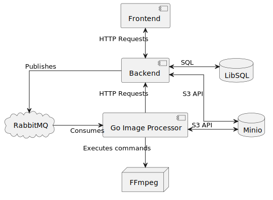

# Web Technologien // begleitendes Projekt Sommersemester 2024
Zum Modul Web Technologien gibt es ein begleitendes Projekt. Im Rahmen dieses Projekts werden wir von Veranstaltung zu Veranstaltung ein Projekt sukzessive weiter entwickeln und uns im Rahmen der Veranstaltung den Fortschritt anschauen, Code Reviews machen und Entwicklungsschritte vorstellen und diskutieren.

Als organisatorischen Rahmen für das Projekt nutzen wir GitHub Classroom. Inhaltlich befassen wir uns mit einer Client-Server Anwendung mit deren Hilfe [Bilder mit Langzeitbelichtung](https://de.wikipedia.org/wiki/Langzeitbelichtung) sehr einfach nachgestellt werden können.

Warum ist das cool? Bilder mit Langzeitbelichtung sind gar nicht so einfach zu erstellen, vor allem, wenn man möglichst viel Kontrolle über das Endergebnis haben möchte. In unserem Ansatz, bildet ein Film den Ausgangspunkt. Diesen zerlegen wir in Einzelbilder und montieren die Einzelbilder mit verschiedenen Blendmodes zu einem Bild mit Langzeitbelichtungseffekt zusammen.

Dokumentieren Sie in diesem Beibootprojekt Ihre Entscheidungen gewissenhaft unter Zuhilfenahme von [Architectual Decision Records](https://adr.github.io) (ADR).

Halten Sie die Anwendung, gerade in der Anfangsphase möglichst einfach, schlank und leichtgewichtig (KISS).

## Architektur

Die Anwendung besteht aus den folgenden Komponenten:

1. Zentrales Backend
   - Verbindung zu Microservices + Datenbank
   - Technologie: **NestJS**
2. Go Service
    - Verarbeitung der Bilder und Videos
    - Technologie: **Go**
3. Frontend
    - Anzeige der Projekte
    - Technologie: **NextJS**

Folgende Services werden zusätzlich verwendet:

1. Minio
    - Speicherung der Projekte
2. RabbitMQ
    - Kommunikation zwischen Go Service und Backend
3. FFmpeg
    - Verarbeitung der Videos



## Starten der Anwendung

Um die Anwendung im Production Modus zu starten, kann sie mit Docker Compose gestartet werden:

```bash
docker-compose up -d
```

Jetzt kann über `https://localhost` das Frontend aufgerufen werden.

## Lokale Entwicklung

Für die lokale Entwicklung werden folgende Tools benötigt:

- Docker
- Docker Compose
- Node.js
- Pnpm
- Go

Zum Starten der Anwendung (für Development) müssen folgende Schritte durchgeführt werden (Für jeden Service sollte ein neues Terminal geöffnet werden):

1. Minio + RabbitMQ + Reverse Proxy
    ```bash
    docker-compose up -d minio rabbitmq reverse-proxy
    ```
2. Kopiere die `.env.example` Datei in `.env` und ändere ggfs. die Werte
    ```bash
    cp backend/.env.example backend/.env
    cp go-image-processor/.env.example go-image-processor/.env
    cp frontend/.env.example frontend/.env
    ```
3. Backend
    ```bash
    cd backend
    pnpm install
    pnpm dev
    ```
4. Go Service
    ```bash
    cd go-image-processor
    go mod download
    air
    ```
5. Frontend (Sollte beim Install step der Fehler ENAMETOOLONG auftreten, dann kurz auf pnpm@7.33.5 downgraden für den install, danach kann wieder ein upgrade ausgeführt werden)
    ```bash
    cd frontend
    pnpm install
    pnpm dev
    ```

## Zeitaufwand

| Aufgabe                                     | Zeitaufwand |
|---------------------------------------------|-------------|
| Initialer Go Service                        | 6h          |
| Vergleich Performance gegen Magick          | 2h          |
| Minio Anbindung                             | 2h          |
| AMQP Anbindung + Backend Erstellung         | 4h          |
| Simples initiales Frontend                  | 2h          |
| Total Issue #1                              | 16h         |
|                                             |             |
| UI Umstellen auf Projekte                   | 5h          |
| Backend + Go Service auf Projekte umstellen | 6h          |
| UI fixes + improvements                     | 2h          |
| Real Time Progress Indication               | 3h          |
| Total Issue #2                              | 16h         |
|                                             |             |
| Weight einfügen                             | 2h          |
| Auf NextJS wechseln                         | 7h          |
| Refactoring                                 | 3h          |
| Total Issue #3                              | 12h         |
|                                             |             |
| Refactoring                                 | 4h          |
| Total Issue #4                              | 4h          |
|                                             |             |
| Total                                       | 34h         |

## TODO

- Update Readmes
- Add Dockerfiles
- Add explaination for other developers
